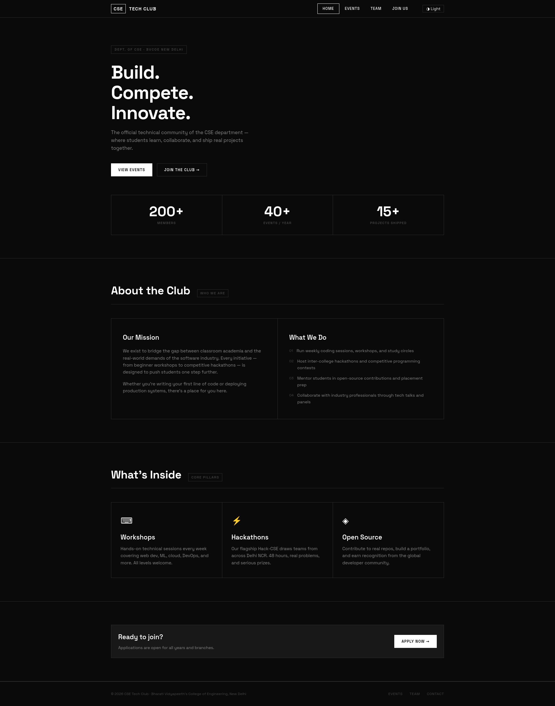
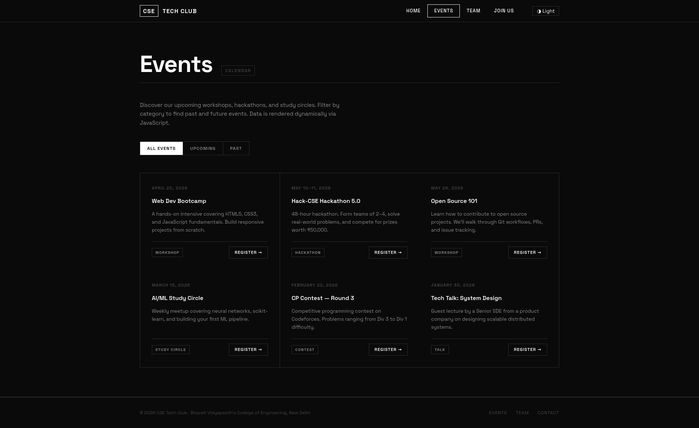
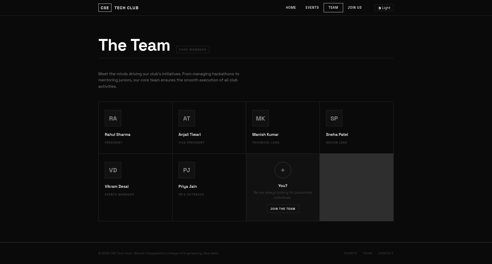
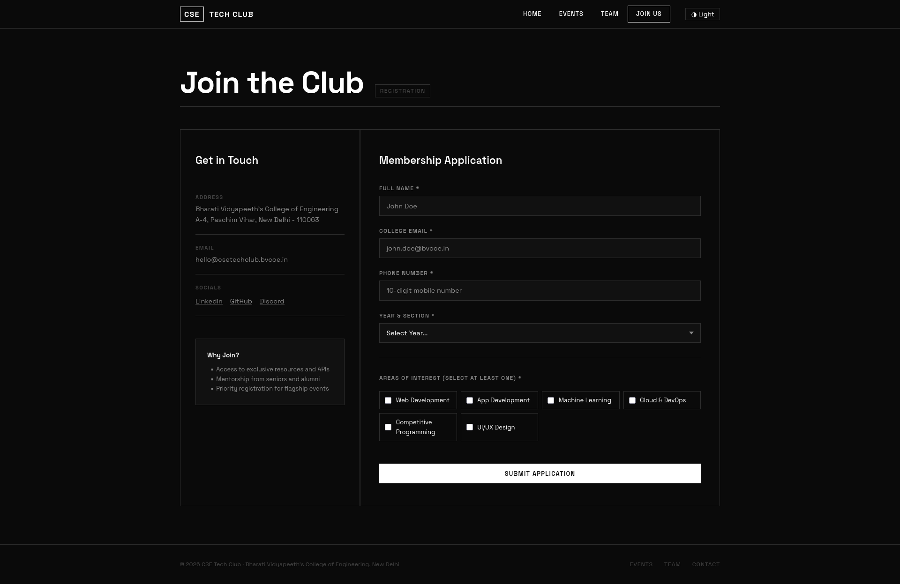

# Technical Club Portal — Project Report

**Name:** Pabitra Mondal  
**Course/Section:** Btech CSE(aiml), 6th sem.   
**Live Site:** [https://p-kaizoku.github.io/cse_tech_club/](https://p-kaizoku.github.io/cse_tech_club/)

---

## 1. Site Structure

The project is structured into four distinct HTML pages, organized to separate content, styling, and functionality (separation of concerns):

```
wt_assignment/
├── index.html          # Hero section, club mission, features, stat counters
├── events.html         # Dynamic listing of JS-rendered events
├── team.html           # Grid layout of core team members
├── contact.html        # Real-time validated registration form
├── css/
│   └── style.css       # Global design system & component styles
├── js/
│   └── main.js         # Interactive behavior and form validation
└── ss/                 # Screenshot directory
```

- **Semantic HTML5:** Applied `<header>`, `<nav>`, `<main>`, `<section>`, and `<article>` to provide meaning to algorithms and screen readers.
- **Shared Assets:** All pages share a single `style.css` file and `main.js` file, ensuring caching efficiency and absolute consistency across pages.

## 2. Key Design Decisions

The club portal was built using a **Monochrome / Brutalist / Editorial Design System** without any external libraries.

- **Monochrome Palette & Typography:** Instead of generic bright colors, a strictly black `#0a0a0a`, grey, and white palette is used paired with the bold font *Space Grotesk*. This gives the club a serious, premium, and tech-forward "hacker" identity.
- **Sharp Brutalist Elements:** Boxy borders (`1px solid #2e2e2e`) and sharp corners (`border-radius: 0`) were explicitly chosen over common rounded soft UI to invoke a structural, architectural feel. Grid gap trick (`gap: 1px` with a border background) was used to render crisp hairline dividers. 
- **Responsive Layout Architecture:**
  - Designed mobile-first, using CSS Grid primarily for page layouts, transitioning from 1 column on mobile to 2/3/4 columns on desktop using `@media (max-width: 1024px)` and `@media (max-width: 600px)` breakpoints.
  - Flexbox is used for 1-dimensional components (Navigation, footer alignments, form groups).
- **JavaScript Enhancements:**
  - **Dark/Light Theme Toggle:** A custom robust toggle using `localStorage` ensures user preference is saved, mapping directly to CSS Variables.
  - **Dynamic Rendering:** Event cards are generated by iterating an array of JSON objects, simulating a real data-fetching experience.
  - **Client-Side Validation:** Form inputs give realtime feedback on `blur` and `submit`, using Regex patterns for the college email and 10-digit phone number.
  - **Scroll Reveal Animations:** IntersectionObservers smoothly fade elements in as they enter the viewport, giving a polished feel.

---

## 3. Page Screenshots

### Home Page 
*Features the Hero banner, about section, and feature cards.*


### Events Page
*Dynamically populated list of events and hackathons.*


### Team Page
*Responsive grid showing member cards with hover-bio effects.*


### Contact / Registration Page
*Realtime validation form for club applications.*

